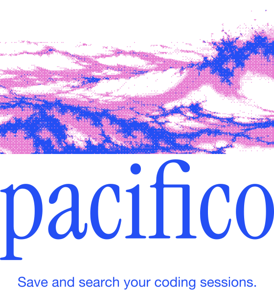

<p align="center">
  
</p>

Pacifico keeps a searchable local archive of Claude Code, Codex, Cursor, Antigravity, and OpenCode conversations, and lets your agents recall them through MCP.

[Website](https://pacifico.emersoftware.cl/) · [Español](https://pacifico.emersoftware.cl/es/)

## Install

```sh
brew install emersoftware/tap/pacifico && pacifico install
```

macOS and Linux · ARM64 and x86-64 · No Bun or Node.js required.

Restart your agent client after installation. You can also download a standalone binary from [Releases](https://github.com/emersoftware/pacifico/releases).

## Use

```sh
pacifico "database migration"
pacifico context
pacifico --help
```

For optional background indexing on macOS:

```sh
pacifico daemon start
```

Your archive stays in `~/.local/share/pacifico`. Uninstalling the integrations preserves your archived sessions.

Share your archive between computers or give another agent access with the [self-hosted server](docs/SERVER.md).

## Credits

Inspired by and built on [nicknisi/sessions](https://github.com/nicknisi/sessions), by Nick Nisi and its contributors. [MIT license](LICENSE).
