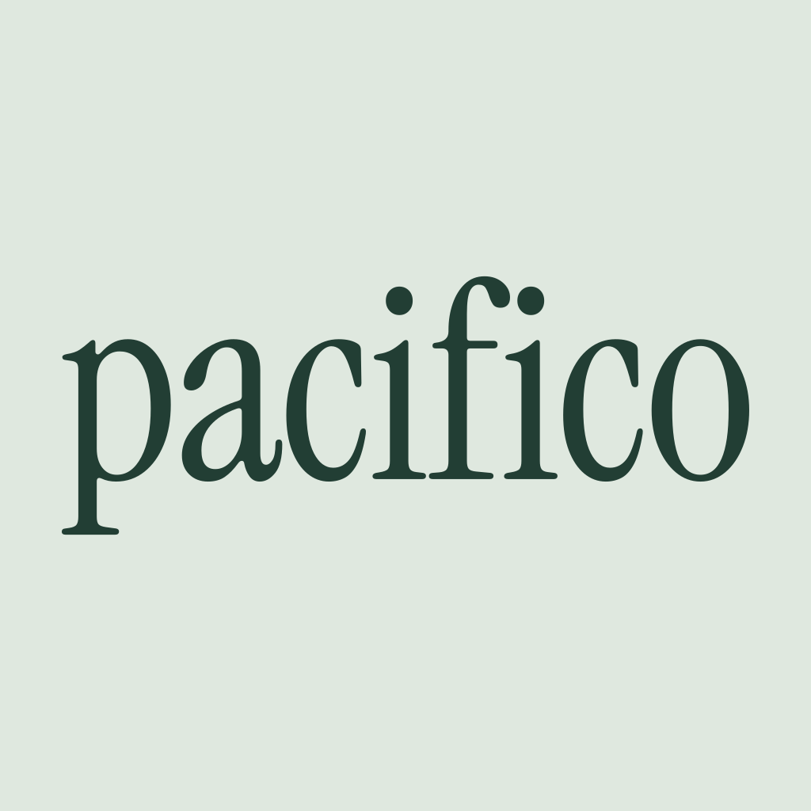

<p align="center">
  
</p>

<p align="center">Your coding sessions, remembered.</p>

Pacifico archives and searches your local AI coding conversations, then makes them available to your agents through MCP. Find a past decision, recover context, and keep a durable copy of work across Claude Code, Codex, Pi, and OpenCode.

**Inspired by and built on [nicknisi/sessions](https://github.com/nicknisi/sessions).** Pacifico is an MIT-licensed derivative that preserves its session engine and adds a modular monorepo, a separate installation namespace, and optional background indexing on macOS. Credit to Nick Nisi and the upstream contributors for the foundation.

## Install

```sh
brew install emersoftware/tap/pacifico && pacifico install
```

Available for macOS and Linux on Apple Silicon/ARM64 and Intel/AMD x86-64. The executable includes its runtime: **no Bun, Node.js, or Python installation is required**. Homebrew is the only prerequisite for this installation command.

`pacifico install` configures supported agent integrations detected on your machine. Restart the agent client to load its MCP connection. `setup` remains an alias for `install`.

You can also download a binary from [GitHub Releases](https://github.com/emersoftware/pacifico/releases), extract it, and put `pacifico` on your `PATH`.

## Use

```sh
pacifico "database migration"
pacifico context
pacifico vault status
pacifico --help
```

- Search conversations with SQLite FTS5 and filters for project, agent, and time.
- Read session messages, tool activity, and surrounding context through MCP.
- Keep imported transcripts in a durable local archive.
- Use inherited memory, reporting, and session recall features.
- Optionally enable semantic search with Ollama.

Text search and archiving work locally without a model or a subscription. Optional features can invoke external tools or retrieve pricing data; see the [upstream reference](docs/upstream/README.md) for feature details. Commands in that historical document use the original `sessions` name; use `pacifico` here.

## Background indexing

On macOS, enable an optional LaunchAgent to import new sessions every 30 seconds while you are logged in:

```sh
pacifico daemon start
pacifico daemon status
pacifico daemon stop
```

The daemon is opt-in. On Linux, run `pacifico daemon run` for a single import pass; automatic service installation currently supports macOS only. A transcript removed before its first import cannot be recovered.

## Data and removal

Archives and memory live in `~/.local/share/pacifico`; rebuildable indexes live in `~/.cache/pacifico`. Pacifico uses its own MCP/plugin identifier and does not migrate or remove an existing `sessions` installation.

```sh
pacifico uninstall
brew uninstall pacifico
```

Uninstalling the integrations stops the daemon and preserves archived transcripts and memory. The inherited `SESSIONS_*` environment variables remain available to configure sources and isolate data directories.

## Development

This is a TypeScript/Bun monorepo:

```text
apps/cli          Terminal interface and executable entry point
packages/core     Parsers, search, archive, memory, and reports
packages/agents   MCP, client integrations, skills, and daemon
apps/site         Preserved upstream website reference, with its own lockfile
```

Production dependencies flow from the CLI to agents/core, and from agents to core. The inherited website is reference material and is not the Pacifico website.

```sh
bun install --frozen-lockfile
bun run typecheck
bun run lint
bun run format:check
bun run check:architecture
bun test
bun run build
bun run test:binary
```

Bun is needed to develop and compile the project, not to run the release binary. All code comments are written in English.

Read the [architecture](docs/pacifico/ARCHITECTURE.md), [design decisions](docs/pacifico/DECISIONS.md), [harness data map](docs/pacifico/HARNESS-DATA.md), and [release guide](distribution/README.md). The initial research notes are in Spanish. The design work follows [Ousterhout's software design skill](https://github.com/ia-revi/skills/tree/main/skills/ousterhout-software-design).

## Credits and license

[MIT](LICENSE). See [NOTICE](NOTICE) for the upstream revision and provenance. Pacifico is maintained by [emersoftware](https://github.com/emersoftware) and is not affiliated with Mosaic. Original third-party acknowledgments are retained in the source and upstream documentation.
