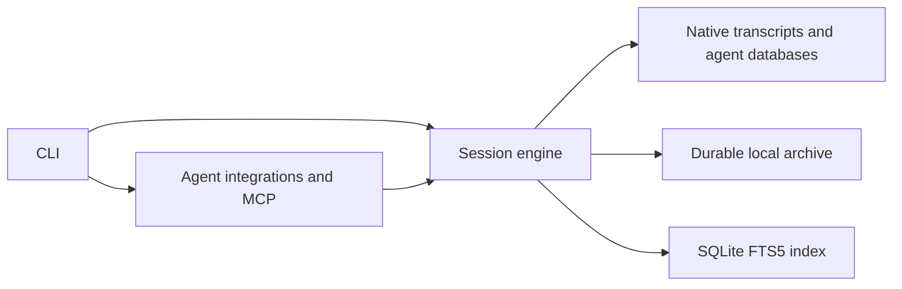

# Architecture

Pacifico is a TypeScript/Bun monorepo with four production packages and a static website.

```text
apps/
  server/src/       Authenticated HTTP/MCP server and PostgreSQL archive
  cli/src/          Executable entry point, arguments, selection, and terminal output
  site/             Bilingual Astro website with React and Tailwind CSS
packages/
  core/src/         Parsers, sources, SQLite search, archive, and reports
  agents/src/       MCP server, client configuration, installer, and background service
  agents/plugin/    MCP integration manifests embedded in the executable
scripts/            Code generation and integration checks
docs/              Architecture, MCP, daemon, testing, and releases
```

Production dependencies flow from the CLI to agents/core, and from agents to core. Core does not import production code from either of the other packages. Some integration tests exercise those boundaries; the architecture checker distinguishes tests from runtime dependencies.



The private Bun workspaces declare their dependencies and use package-name imports. Exported subpaths are internal monorepo interfaces, not a stable third-party API. The website has its own dependencies and lockfile, so its Astro/TypeScript requirements do not affect the compiled CLI.

## Module boundaries

Agent integrations own client-specific configuration, plugin registration, MCP schemas, and launchd details. Core owns native formats, archive retention, indexing, and retrieval. The CLI owns arguments and terminal interaction. Interfaces should hide a meaningful implementation decision; avoid adding layers that only forward calls.

The core currently has these boundaries:

| Directory or module      | Responsibility                                                                      |
| ------------------------ | ----------------------------------------------------------------------------------- |
| `sources/`               | Discover native locations and read harness-specific formats without modifying them. |
| `storage/`               | SQLite schema, native-document index, and durable document copies.                  |
| `vault/archive.ts`       | Atomic session snapshots and their manifest.                                        |
| `ingestion/sessions.ts`  | Refresh sessions on demand or in the daemon, archive snapshots, and update FTS.     |
| `retrieval/sessions.ts`  | Query the session index and load session details.                                   |
| `retrieval/events.ts`    | Read native records with independent, resumable pagination.                         |
| `ingestion/documents.ts` | Read native documents, archive them, and update their search index.                 |
| `retrieval/documents.ts` | Search and paginate archived native documents.                                      |
| `session-io.ts`          | Read live sessions with an archive fallback and detect source changes.              |
| `cache.ts`               | Compatibility exports for existing callers.                                         |

Session readers cover Claude Code JSONL, Codex JSONL and Zstandard-compressed rollouts, OpenCode SQLite, Cursor CLI blob stores and JSONL, Cursor IDE composer/bubble records and legacy `ItemTable` chat containers in `state.vscdb`, and Antigravity SQLite steps with companion JSONL transcripts. Codex plain and compressed twins share one archive identity; the plain source takes precedence, and the archive stores decompressed JSONL. Corrupt compressed updates leave the prior durable copy readable. Cursor CLI discovery includes nested workspace stores, direct chat stores and `acp-sessions` stores. Cursor tool projections read modern `toolFormerData` and older capability `bubbleDataMap` records. Capability records remain attached as native variants, including unknown fields and incomplete arguments. Cursor database change detection includes committed WAL data. Its IDE conversations use a virtual path containing the database path and composer identifier.

The OpenCode reader lives in `sources/opencode.ts`; the root `opencode.ts` retains compatibility exports. OpenCode exports include complete session, message and part rows alongside their search projection. Those reads share a SQLite transaction. Database and WAL changes invalidate cached sessions, including part updates without a new message. The importer passes that same serialized snapshot to the archive instead of rereading OpenCode for the backup.

Cursor and Antigravity exports preserve original event records alongside the normalized message projection. Their indexed projection is also passed directly to the archive, including retained historical steps, rather than rereading the native sources for that backup. Antigravity combines database steps and companion logs by step identifier, retaining native variants and binary payloads. The SQLite reader projects verified user and assistant text fields; other step types remain uninterpreted. If companion files disappear, previously archived steps survive subsequent imports. Missing native sessions remain readable from their latest durable snapshot. The archive stores the native session identifier rather than deriving it from the export filename.

Claude child transcripts under `<session>/subagents/` are discovered and archived independently, including their raw sidechain and agent metadata. Because they carry the parent session ID, their lookup ID combines that ID with `/subagents/<filename-stem>`. Codex uses `session_meta.payload.id`; a filename is only a fallback when native identity is absent.

Native documents use separate `memory`, `instructions`, and `artifact` categories. Existing Markdown memories from Claude Code, Codex, and Antigravity are copied with their native paths and content hashes. Rules and task artifacts are not classified as memories. Antigravity asynchronous command logs under `.system_generated/tasks/task-*.log` are archived as artifacts with their original paths and complete UTF-8 content; they are available through native-document search and reading. The importer never generates memory content. Archived documents remain searchable after the source disappears and can rebuild their SQLite FTS index.

Legacy Cursor `chatSessions` and `tabs` preserve their explicit message membership and use `legacy:` identifiers within the database. Composer metadata without message bodies is not reconstructed from generation timestamps. Coverage is still incomplete: Antigravity's legacy standalone `.pb` conversations are not imported. Antigravity projects planner tool calls and generic tool-result text (step type 132), retaining error status and auxiliary runtime metadata. Other tool-result payload types remain uninterpreted. Native-document discovery covers home locations and root-level instructions for projects found in indexed sessions. It reads CLAUDE.md and Claude rules, AGENTS.md for Codex/OpenCode, Cursor rules and GEMINI.md for Antigravity. Nested project instruction scopes are not recursively inferred. Session queries live in `retrieval/sessions.ts` and import orchestration in `ingestion/sessions.ts`. Pi is excluded from the supported harness type and discovery. Legacy archive metadata remains readable so existing Pi backups are not deleted.

Session import orchestration, refresh coalescing, and FTS writes live in `ingestion/sessions.ts`. `ingestion/session-projection.ts` serializes native events while retaining their source records.

Session retrieval lives in `retrieval/sessions.ts`; `cache.ts` only re-exports the established internal API.

The daemon reuses the same import operation as MCP. A separate SQLite lock in [`refresh-lock.ts`](../packages/core/src/refresh-lock.ts) protects the full refresh across processes. Archive files are written through temporary files and atomic renames.

Homebrew installs use a verified stable `opt/pacifico/bin/pacifico` alias for MCP configuration and launchd, so removing an old keg does not invalidate either integration. Standalone installations retain their absolute executable path.

See [native source coverage](SOURCES.md), [MCP](MCP.md), [background indexing](DAEMON.md), [testing](TESTING.md), and [releases](RELEASING.md).

### Native events and message offsets

`read_session` message offsets and FTS message hit indices currently share `extractMessages`, which numbers non-empty user and assistant messages. Native tool, system and unknown events remain in the durable projection but are not returned by that message view. Adding them to message pagination alone would break search-hit offsets. `read_session` events mode returns archived JSONL records with separate record offsets. Responses contain at most 20,000 text characters and return a next cursor with record and character offsets, allowing large records to be reconstructed without truncation loss. The event cursor also carries a content version; passing it on subsequent requests rejects changed records, including same-length rewrites. Existing message numbering is unchanged.

## Self-hosted archive

`apps/server` owns HTTP authentication, account/device isolation, PostgreSQL storage and remote queries. It shares pure transcript parsers, pagination and the MCP registration contract with the local application. It does not discover native files on the server.

`core/sync` owns remote configuration and uploading durable local snapshots. Server inventory acts as the acknowledgement record, while the local archive acts as the retry queue. Sync has its own process lock and never holds the local index lock across a network request. Each server update requires the prior hash and preserves an immutable uploaded version.

`agents/remote.ts` routes the four MCP tools to local or remote execution and merges combined queries. Server execution injects an account-bound query implementation into the MCP factory and disables local resources. Missing remote connectivity is explicit in combined results and does not hide local data. No remote snapshot is imported into native harness directories.

See [server deployment and synchronization](SERVER.md).

Agents such as Pancora use the same `pacifico remote` CLI as other clients. `agents/remote-cli.ts` handles shell arguments, JSON output and exit statuses; the shared remote client handles the authenticated transport. No harness-specific connection or role is required.
