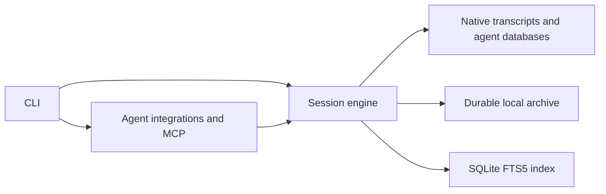

# Architecture

Pacifico is a TypeScript/Bun monorepo with three production packages and a static website.

```text
apps/
  cli/src/          Executable entry point, arguments, selection, and terminal output
  site/             Bilingual Astro website with React and Tailwind CSS
packages/
  core/src/         Parsers, sources, SQLite search, archive, memory, and reports
  agents/src/       MCP server, client configuration, installer, and background service
  agents/plugin/    MCP integration manifests embedded in the executable
scripts/            Generation, validation, and packaging
distribution/      Release and Homebrew instructions
docs/              Reference material and engineering notes
```

Production dependencies flow from the CLI to agents/core, and from agents to core. Core does not import production code from either of the other packages. Some integration tests exercise those boundaries; the architecture checker distinguishes tests from runtime dependencies.



The private Bun workspaces declare their dependencies and use package-name imports. Exported subpaths are internal monorepo interfaces, not a stable third-party API. The website has its own dependencies and lockfile, so its Astro/TypeScript requirements do not affect the compiled CLI.

## Module boundaries

Agent integrations own client-specific configuration, plugin registration, MCP schemas, and launchd details. Core owns native formats, archive retention, indexing, and retrieval. The CLI owns arguments and terminal interaction. Interfaces should hide a meaningful implementation decision; avoid adding layers that only forward calls.

The daemon reuses the same import operation as MCP. A separate SQLite lock in `core/refresh-lock.ts` protects the full refresh across processes. Archive files are written through temporary files and atomic renames.

Homebrew installs use a verified stable `opt/pacifico/bin/pacifico` alias for MCP configuration and launchd, so removing an old keg does not invalidate either integration. Standalone installations retain their absolute executable path.

## Existing limitations

`core/cache.ts` remains large, and some inherited modules combine report formatting with their operations. An extraction should isolate independently changing knowledge behind a simpler interface, rather than merely reduce a file's line count. See [design decisions](DECISIONS.md) and [background indexing](DAEMON.md).
