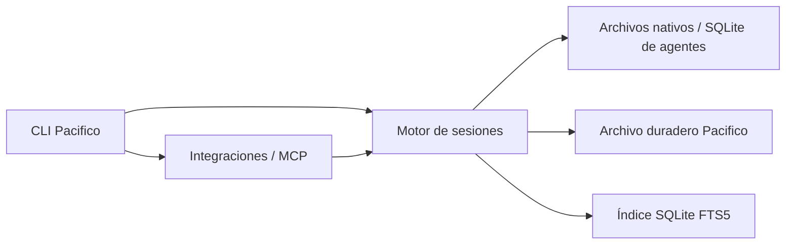

# Arquitectura de Pacifico

```text
apps/
  cli/src/             entrada, argumentos, selección y presentación de terminal
  site/                sitio de referencia heredado; lockfile independiente
packages/
  core/src/            parsers, fuentes, SQLite/FTS, archivo, memoria y reportes
  agents/src/          servidor MCP, configuración de clientes, instalación y servicio de fondo
  agents/plugin/       skills y manifiestos; fuente del embed compilado
scripts/               generación, verificación y distribución
distribution/          guía de releases y distribución Homebrew
docs/pacifico/            investigación, decisiones y resultados
```



Los paquetes Bun privados `@pacifico/core`, `@pacifico/agents` y `@pacifico/cli` son
workspaces reales, con dependencias declaradas. Las importaciones entre paquetes
usan sus nombres. `core` no importa código de producción de `agents` ni `cli`.
Algunas pruebas integradas del motor sí ejercitan esas superficies; no son
dependencias de producción. La verificación de arquitectura contempla esa
distinción.

El archivo y los parsers conservan sus interfaces probadas. No se agregaron
fachadas que simplemente reexportan funciones. Los subpaths exportados son
internos al monorepo; no se publican como promesa de API estable a terceros.

## Aplicación concreta de Ousterhout

- **Ocultar información:** conocer TOML de Codex o plugin registries corresponde
  a `agents`; los consumidores del motor no requieren el SDK MCP.
- **Módulos profundos:** buscar sigue resolviendo descubrimiento, actualización,
  ranking y referencias detrás de la operación existente. La CLI no organiza SQL.
- **Diferente abstracción por capa:** argumentos de terminal → operación de
  búsqueda; llamada MCP → respuesta validada y acotada.
- **Diseñar dos veces:** DECISIONS.md compara rewrite vs. compilación y capas
  generales vs. módulos por conocimiento.
- **Conservar invariantes:** desinstalar elimina integración, no memoria humana
  ni archivo duradero; el namespace Pacifico evita apropiarse de una instalación sessions.
- **Medir:** se registra baseline y se corre la suite después del refactor. No se
  afirma una mejora de rendimiento por haber cambiado carpetas.

## Deuda conocida

`core/cache.ts` sigue siendo grande y algunos módulos del motor combinan
operación y formato de reporte. El tamaño de un archivo no basta para dividirlo.
Una extracción futura necesita identificar una decisión que cambie por separado
y una interfaz más simple que la implementación que esconde.

El daemon reutiliza el motor desde `agents/daemon.ts`. El bloqueo entre procesos
vive en `core/refresh-lock.ts`; también protege las consultas MCP. Ver [DAEMON.md](DAEMON.md).
